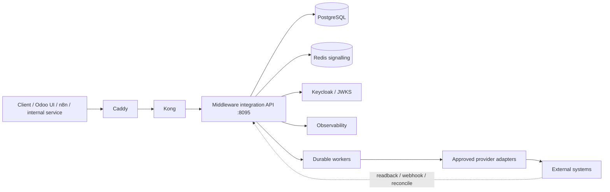
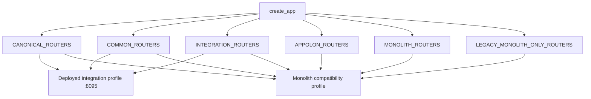
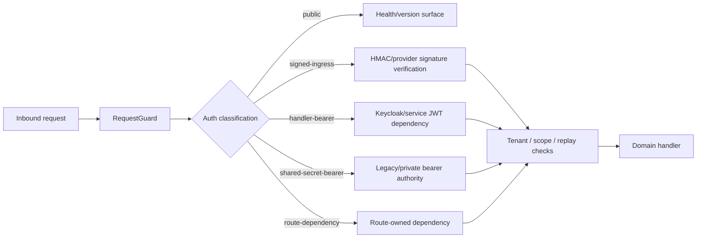
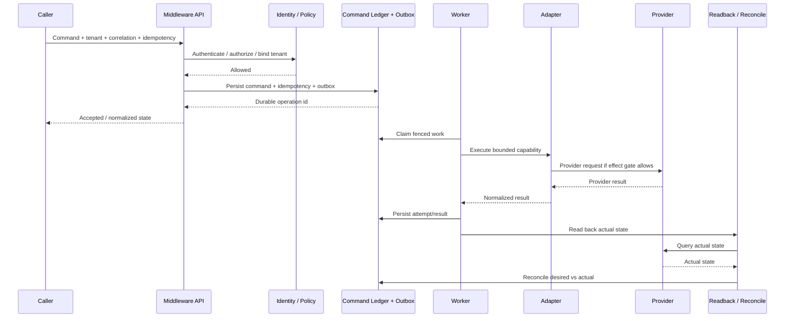
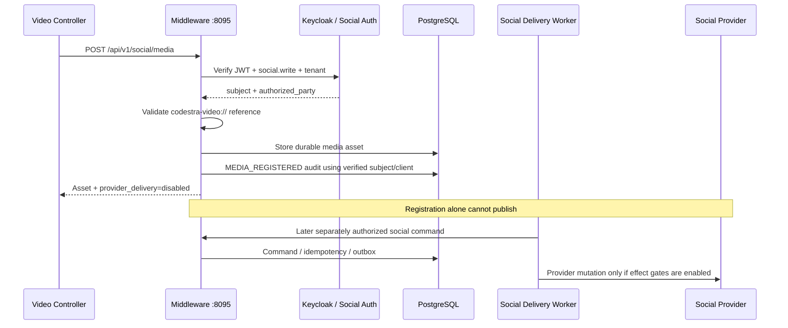
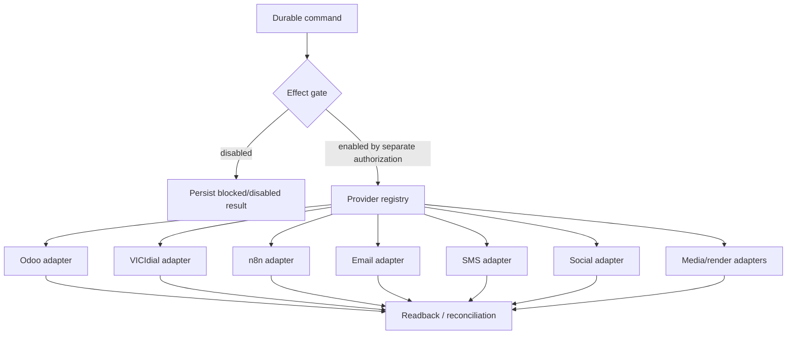
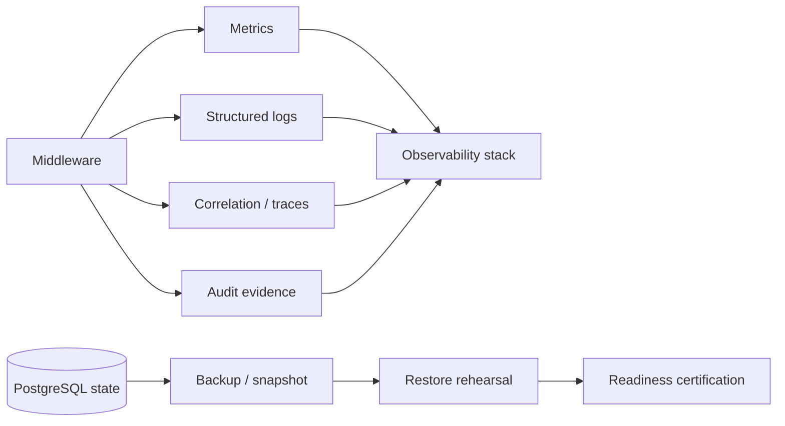
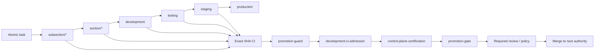

# Middleware — Current Logic and Architecture

> Repository: `appolon1908/Middleware-`
>
> Canonical public runtime: Middleware integration profile on `:8095`
>
> Safety default: `PRODUCTION_GO=NO`, `LIVE_CAPABILITIES_ENABLED=NO`,
> `EXTERNAL_EFFECTS=false`
>
> This document describes the source architecture and promotion logic. A source
> change is not production deployment; protected exact-SHA CI and promotion
> gates remain authoritative.

## 1. System boundary



### Boundary rules

- Public application traffic follows **Caddy → Kong → Middleware `:8095`**.
- `/internal/*` and `/metrics` remain private and are not public application
  routes.
- Middleware owns cross-system authorization, tenant binding, idempotency,
  durable command state, audit evidence, provider-effect gates, readback and
  reconciliation.
- Adapters never become the canonical business datastore.
- Production/provider mutations remain fail-closed unless separately authorized.

## 2. Application and router authority

There is one primary FastAPI application construction authority:

```text
app/application.py
  create_app(settings, profile)
       |
       +-- configuration validation
       +-- RuntimeState lifecycle
       +-- one RequestGuard
       +-- health/readiness authority
       +-- router registry
       +-- duplicate-route assertion
       +-- canonical OpenAPI/error handling
```

Router ownership is centralized in `app/router_registry.py`.



New deployed APIs must be present in the integration profile when they are
expected on `:8095`; adding a route only to the monolith does not make it a
deployed API.

## 3. Authentication and request-policy logic

Middleware separates transport/request policy from domain authorization.



Every live OpenAPI operation carries `x-codestra-auth-mode`, sourced from the
same request-policy authority used at runtime.

Canonical request metadata remains:

- `X-Tenant-ID` where tenant context is required;
- `X-Correlation-ID` for traceable mutations/flows;
- `X-Causation-ID` where causal chaining applies;
- `Idempotency-Key` for effect-capable commands.

## 4. Durable command execution

Effect-capable work is not a direct provider call.



### Invariants

- Idempotency is durable, not process-local.
- Outbox/ledger state is committed before external effects.
- Worker leases/fencing prevent duplicate concurrent ownership.
- Provider results are normalized before entering canonical state.
- Unknown provider outcomes require readback/reconciliation before retry.
- No adapter may bypass command, ledger, outbox or effect-gate authority.

## 5. Social media artifact handoff

Completed media is registered with Middleware before any publishing workflow.



Media registration rules:

- only normalized internal `codestra-video://` references are accepted;
- credentials, ports, query strings, fragments and traversal are rejected;
- audit actor provenance comes from the verified Keycloak principal;
- caller-supplied actor identity is not authoritative;
- registering media does not enable upload, scheduling or publishing.

## 6. API contract authority

Hand-maintained endpoint lists are informational only. Runtime/generated
contracts are authoritative.

| Authority | Purpose |
|---|---|
| `app/application.py` | application/profile construction |
| `app/router_registry.py` | route ownership and profile membership |
| `contracts/platform/middleware-openapi.generated.json` | generated control-plane OpenAPI |
| `config/api-completion-matrix.yaml` | generated control-plane operation inventory |
| `contracts/platform/middleware-integration-openapi.generated.json` | exact deployed integration-profile OpenAPI |
| `config/api-integration-completion-matrix.yaml` | exact deployed integration-profile operation/auth inventory |
| `deploy/public-api-route-contract.json` | approved edge-route authority |

The integration-profile contract is generated independently so a route cannot
be declared implemented merely because it exists in a monolith/control-plane
profile.

## 7. Provider and effect boundaries



Default source policy remains deny-first. A successful build or merge does not
authorize production effects.

## 8. Observability and recovery



Readiness must fail closed when required PostgreSQL, Redis or identity
dependencies are unavailable. Restore/rollback evidence is part of exact-SHA
release certification.

## 9. Development and promotion logic

Repository development is hierarchical. Direct feature-to-production promotion
is not the normal path.



### Promotion rules

1. Subsection work must be certified before section promotion.
2. Section scope must be certified before development promotion.
3. Exact-SHA CI is authoritative; CI from an older SHA does not certify a new
   commit.
4. The Development Department control plane verifies the exact branch/base/SHA
   before promotion.
5. Protected-branch rules and required reviews are not bypassed.
6. Force pushes to protected/promotion branches are prohibited.
7. Production remains `GO=NO` until a separate release mission explicitly
   authorizes activation.

## 10. Logic ownership summary

| Concern | Canonical owner |
|---|---|
| public edge | Caddy + Kong |
| deployed API | Middleware integration profile `:8095` |
| route membership | `app/router_registry.py` |
| request/auth classification | `app/core/request_guard.py` + route auth dependencies |
| identity | Keycloak/JWKS |
| durable command state | PostgreSQL command ledger/outbox |
| signalling | Redis, non-authoritative |
| provider execution | registered adapters/workers |
| actual-state verification | readback/reconciliation |
| API description | generated OpenAPI/matrices |
| promotion authority | repository policy + exact-SHA CI + Development Department control plane |
| production effects | separately approved release/effect gates |

## 11. Design review rule

When code changes any of these boundaries—router profile, auth mode, durable
command flow, provider effect gate, API authority, or promotion logic—this
document and the relevant generated contracts must change in the same reviewed
lane. Architecture documentation that disagrees with registered runtime source
is considered stale and must not be used as release authority.
